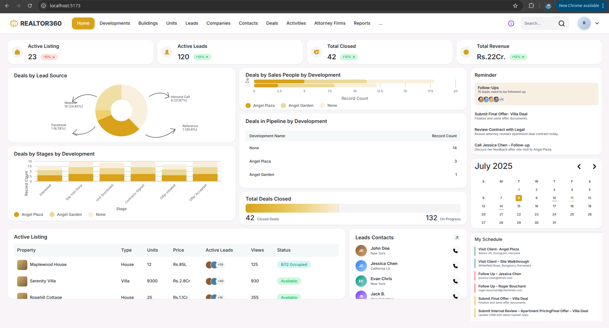

# Realtor360 Dashboard

Pixel-perfect frontend implementation of the Realtor360 CRM dashboard Figma design: https://www.figma.com/proto/w3ZJn4OeQVLudyC0jOzOYW/Realtor360.

## Tech Stack

- React
- TypeScript
- Vite
- Tailwind CSS
- Recharts

## Screenshots



## Features

- Stat cards
- Lead-source donut chart
- Deals-by-stage stacked chart
- Sales-people chart
- Pipeline table
- Deals-closed progress bar
- Active listings table
- Reminders
- Calendar
- Schedule
- Leads contacts

## Getting Started

### Prerequisites

- Node.js 18+

### Setup

```bash
git clone https://github.com/Prince-Prajapati07/Realtor360-Dash.git
cd Realtor360-Dash
npm install
npm run dev
```

### Build

```bash
npm run build
npm run preview
```

## Project Structure

```text
.
├── src/
│   ├── components/       # Dashboard UI components
│   ├── data/             # Static mock dashboard data
│   ├── App.tsx           # Page composition
│   ├── main.tsx          # React entry point
│   └── styles.css        # Tailwind imports and shared styles
├── screenshots/          # Project screenshots
├── index.html
├── package.json
├── tailwind.config.js
├── tsconfig*.json
└── vite.config.ts
```

## Notes

- Scope is the Home dashboard screen from the shared prototype link.
- All data is static mock data; there is no backend.
- Two quirks are replicated faithfully from the Figma file itself: the donut segment counts and percentages are inconsistent in the design, and the My Schedule item "Submit Internal Review – Apartment PricingFinal Offer – Villa Deal" contains a typo present in the original design.
